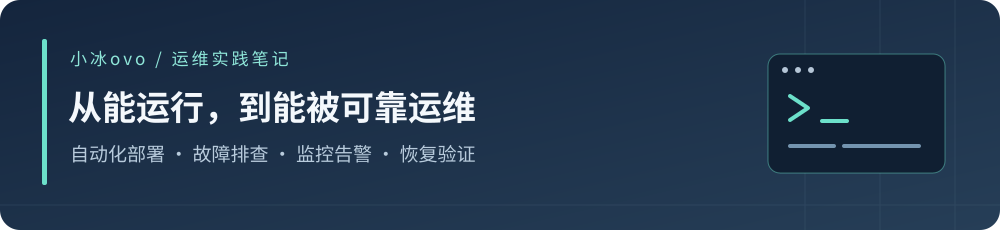

**深圳求职 · Linux 运维 / 云平台运维方向**

用脚本减少重复操作，用证据判断系统状态，用演练验证恢复能力。

[代表项目](https://github.com/wanghaibing07/retail-reliability-lab) · [中文速读](https://github.com/wanghaibing07/retail-reliability-lab/blob/main/docs/portfolio/plain-language-guide.md) · [架构与讲解](https://github.com/wanghaibing07/retail-reliability-lab/blob/main/docs/portfolio/architecture.md)

## 👋 关于我

我是小冰ovo，正在通过实际部署、排障和恢复演练积累 Linux 与 Kubernetes 运维能力。我关注服务是否真的健康、故障影响如何控制，以及恢复结果能否验证。

## 🔧 代表项目：Retail Reliability Lab

基于 **AWS Retail Store Sample App** 搭建的三节点 Kubernetes 可靠性实验室。业务应用来自上游，我的工作集中在自动化交付、监控告警、数据恢复、发布安全与性能证据验证。

| 我做了什么 | 验证了什么 |
| --- | --- |
| Shell 部署与检查脚本 | 两次完整销毁、部署、分层验证 |
| GitHub Actions + Argo CD | 修改先自动检查，再部署；手工偏差自动纠正；资源清理设保护 |
| Prometheus + Alertmanager | 受控告警从触发到恢复的邮件通知，以及发布停滞告警 |
| Orders PostgreSQL 备份恢复 | 实际隔离恢复、应用读回订单、Pod 重建后数据保留 |
| 受控发布失败演练 | 新实例不就绪时旧实例继续服务，通过撤销 Git 配置恢复 |
| Artillery 性能实验 | 30 RPS / 300 秒健康；45 RPS 多轮阶段性退化，最大容量尚未确定 |

**[查看项目与证据 →](https://github.com/wanghaibing07/retail-reliability-lab)**　[正式版本](https://github.com/wanghaibing07/retail-reliability-lab/releases/tag/stage7-v0.8)　[五个工程故事](https://github.com/wanghaibing07/retail-reliability-lab/blob/main/docs/portfolio/incident-stories.md)

## 🧭 我的工程习惯

- 先验证：运行中不等于已就绪，HTTP 200 也不等于所有层面健康。
- 留证据：把改动、观测、恢复步骤和验证结果记录下来。
- 有边界：相关性不等于根因，证据不足时不盲目调参。

实际使用：**Linux · Shell · Git · Kubernetes · GitHub Actions · Argo CD · Prometheus · PostgreSQL · Artillery**。

个人实验项目；不宣称生产级高可用、完整灾备或生产零停机。持续练习把做过的工作讲清楚。
